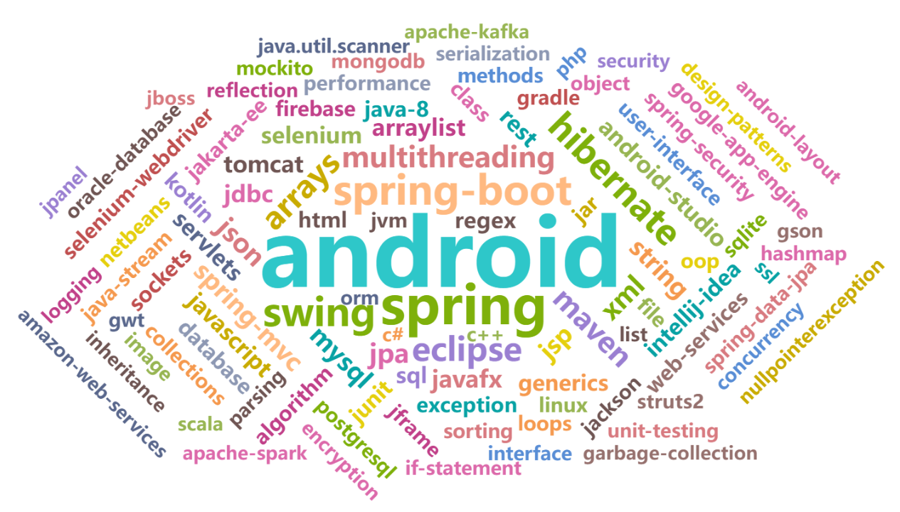
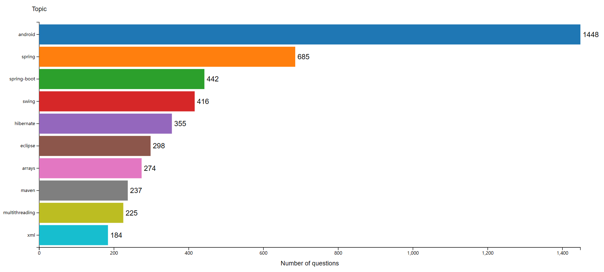
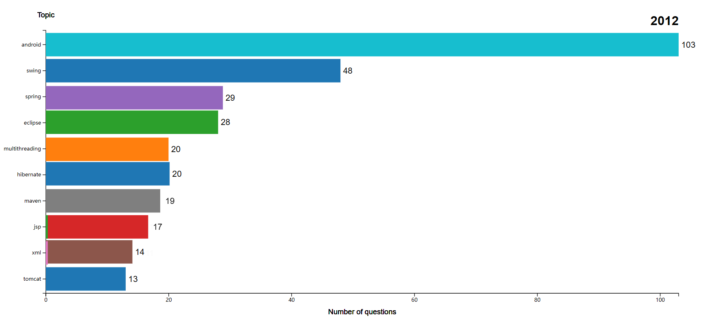
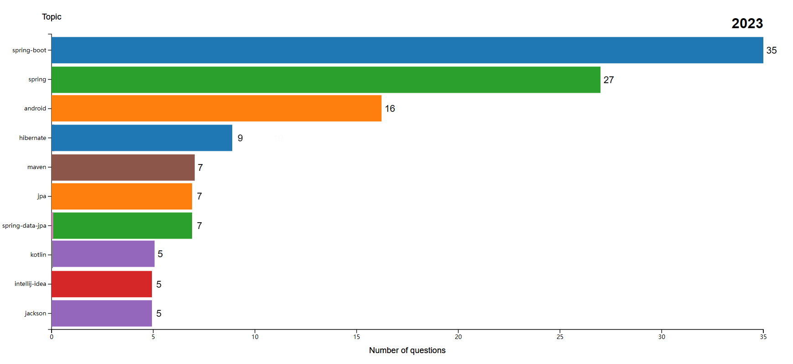
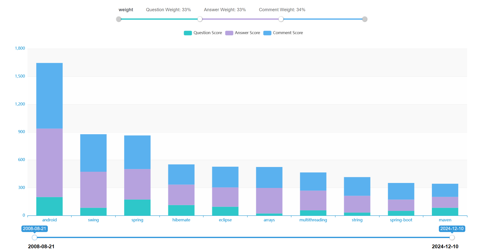
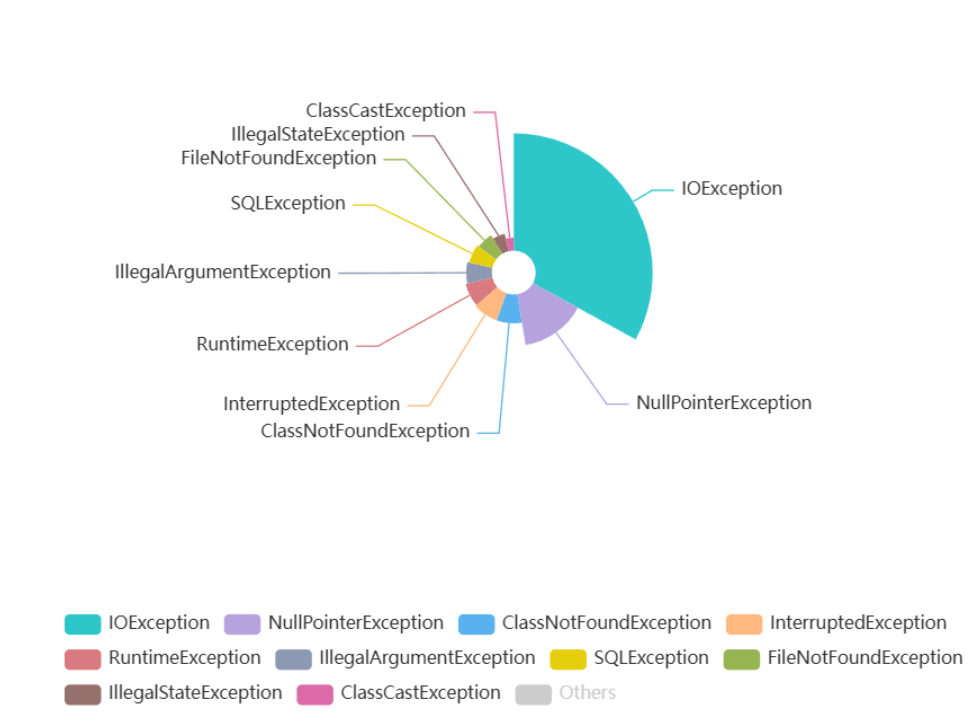
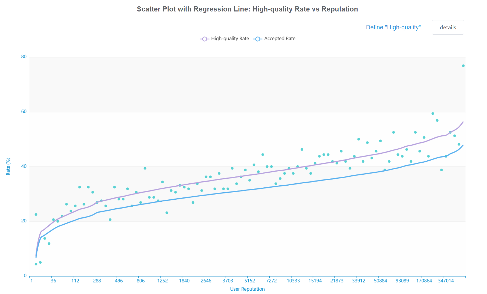
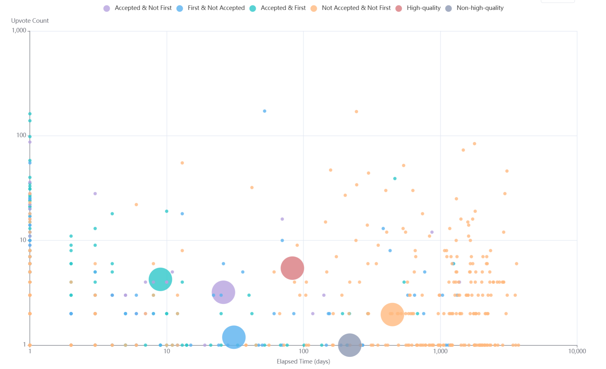
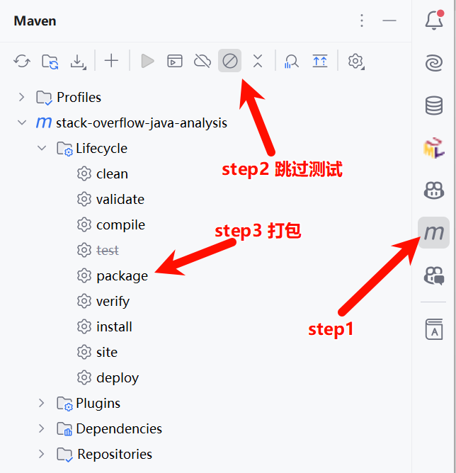

# StackOverflow-Java-Analysis

## 项目简介

本项目旨在通过分析 Stack Overflow 上与 Java 编程相关的问题和答案，帮助开发者更好地理解常见问题、答案质量及用户参与度。我们使用前后端分离，前端基于Vue框架，后端基于Spring Boot 框架开发一个 web 应用程序，该程序能够存储、分析和可视化 Java 编程的 Q&A 数据。

## 项目背景

在软件开发过程中，常常会出现各种问题，开发者可以通过 Q&A 网站（例如 Stack Overflow）来寻求帮助。Stack Overflow 是一个专为程序员提供的问答平台，用户可以在此提问、回答、投票和编辑内容。本项目利用 Stack Overflow 的数据，分析 Java 编程相关的主题、用户参与度、常见错误及高质量答案的影响因素。

## 主要功能

1. **数据收集**：从 Stack Overflow 收集 1000 个与 Java 编程相关的线程数据，并将其存储在数据库中。
2. **数据分析**：实现多个数据分析功能，包括：
   - **Java 主题分析**：找出最常被问及的 Java 主题。
   - **用户参与度分析**：分析高声望用户对主题的参与情况。
   - **常见错误分析**：识别开发者常讨论的错误和异常。
   - **答案质量分析**：探讨影响答案质量的因素。
3. **RESTful 服务**：提供 REST API，允许用户查询特定主题或错误的频率。

## 技术栈

- **前端**：Vue + Vue-CLI + Element-UI + Vue Router + Axios + Echarts + d3
- **后端**：Spring Boot + MybatisPlus + MySQL + Knife4J + OKHttp

## 项目展示

词云图



横向柱状图



赛跑图(Race Chart)





复杂柱状图



饼图



回归曲线



散点图



## 快速开始

### 前端

```bash
# 进入前端项目目录
cd frontend

# 安装依赖
npm install

# 或切换镜像
npm install --registry=https://registry.npmmirror.com

# 本地开发
npm run dev
```

### MySQL数据库

[获取](sql/table.sql)建表语句，创建数据库和表。

> 如果不想自己抓取数据，可以直接获取带数据的建表[sql](sql/table_with_data.sql)

### 后端

1. 修改 `application-dev.yaml` 中的数据库配置。

   ```yaml
   stack-overflow:
     database:
       host: <your-database-host>
       port: <your-database-port>
       database: <your-database-name>
       username: <your-database-username>
       password: <your-database-password>
   ```

2. 修改 `application-dev.yaml` 中对于使用Stack Overflow Restful Api 的配置

   ```yaml
   stack-overflow:
     stack-exchange:
       client-id: <your-stack-exchange-client-id>
       client-secret: <your-stack-exchange-client-secret>
       key: <your-stack-exchange-key>
       save-to-json: <true-or-false> # 是否保存到json文件
       json-path: <your-json-path> # 如果保存到json文件，指定json文件绝对路径
       count: <your-count> # 使用api获取问题数据的数量   
   ```

3. 运行 `test`下`cn.edu.sustech.stackoverflow.CrawlerTest` 类，自动获取数据并根据配置信息存储到数据库（和json文件）中。

4. 运行项目即可

## 部署

使用 [Docker Compose](https://docs.docker.com/compose) 能够十分方便地部署本项目，步骤如下：

1. **构建后端**

   进入`/backend`文件夹，使用Maven将后端打成Jar包: `mvn package -D mvn.test.skip=true`。或者使用IDEA自带的Maven插件打Jar包，步骤如图。之后将Jar包移动到`/deploy/backend`文件夹内

### 

2. **构建前端**

   i. 参考[官方文档](https://nodejs.org/en/learn/getting-started/how-to-install-nodejs)安装Node.js，推荐使用v20.12.0

   ii. 进入`/frontend`文件夹，运行`npm install`安装依赖，然后运行`npm run build:prod`构建静态文件，将会生成`/dist`文件夹

   iii. 将`/dist`中的文件移动到`/frontend/html`文件夹内

3. 部署

   i. 在服务器上参考[官方文档](https://docs.docker.com/engine/install/)安装Docker环境

   ii. 将`/deploy`整个文件夹上传到服务器

   iii. 进入`/deploy`文件夹，运行`docker compose up -d`即可一键部署

   iv. 浏览器访问项目：`http://<服务器ip地址>`
